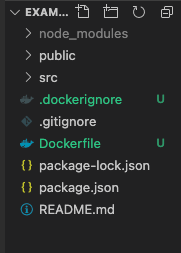
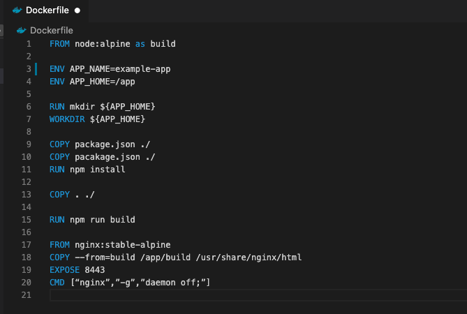
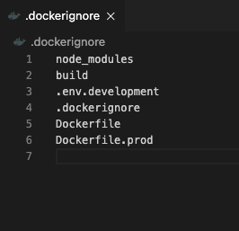
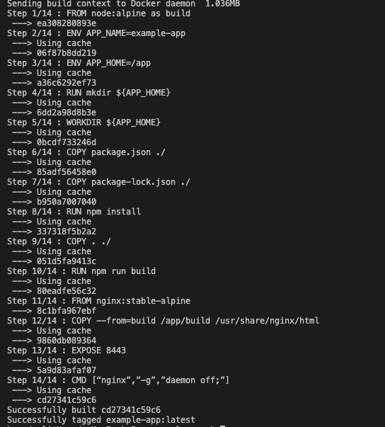

###

###

# Dockerizing A React Application

#### January 23, 2021 by [Hamad Ali](https://github.com/HamadAli248)

When deploying an application as microservices your most likely will be containerising it before deployment as it speeds up the process. When trying to containerise a react application I had issues to choose the best way to do but also how? There were many documentations that are using express with docker. However, this was an issue as I haven’t worked with express but I decided to follow the documentation and try to containerise with using express but when working with express I was getting lot of issues such as modules not found etc so as I found this difficult to do I decided to write a blog to help others.

This blog will show how to create a react application from scratch and containerise it using docker. We will be using a two stage build rather than using express. The advantage of using a two-stage build is you don’t have to be experience in express and once you have been able to build you react application you can build a docker image for your application with a docker file.

If you haven’t yet built your react application use the following command in your terminal to initialise a react application. Note when naming your project, you cannot use:

- capital letters
- spaces (use – to separate name)

### `npx create-react-application (you-application-name)`

In the project root create the files with the exact naming convention

- Dockerfile
- .dockerignore

### Docker File

#### Building your image

Pull the base image:

### `FROM node:alpine as build`

Setting up environment variables, these could also be any other variables the application needs such as ports:

### `ENV APP_NAME=Your-application-name`

### `ENV APP_HOME=/app`

Make working directory for the application:

### `RUN mkdir ${APP_HOME}`

### `WORKDIR ${APP_HOME}`

Copy and install the application dependencies over to docker image:

### `COPY package.json ./`

### `COPY package-lock.json ./`

### `RUN npm install`

Copy the application:

### `COPY . ./`

Build the application:

### `RUN npm run build`

#### Production environment build

This will create an image for production deployment.

Pull a base image from nginx:

### `FROM nginx:stable-alpine`

Copy over the build from to have only the compiled app, ready for production with Nginx

### `COPY --from=build /app/build /usr/share/nginx/html`

Expose a port this will tell Docker that your container's service can be connected to on port which is defined

### `EXPOSE 80`

### `CMD [“nginx”,”-g”,”daemon off;”]`

### Docker ignore File

Add these files (and any other local files which you don’t want to copy into the docker image) to docker ignore as this will stops docker from copying the local files into the image and as the node_modules is a large folder of files and we are already installing this in the build stage we won’t need this and it speeds up the process.

### `node_modules`

### `build`

### `.env.development`

### `.dockerignore`

### `Dockerfile`

### `Dockerfile.prod`

### Docker Run

To build the docker image

### `docker build -t example .`

-t is to tag the image with a name
example is the name of the docker container

Run the docker file:

### `Docker run -p 80:8443 –detach --name example`

- -p asks docker to forward traffic incoming on the host’s port to the container’s port
- --detach asks docker to run this container in the background.
- --name specifies a name with which you can refer to your container in subsequent commands, in this case example.

Visit your application in a browser at localhost:80. You should see your application up and running. At this step, you would normally do everything you could to ensure your container works the way you expected.

All of the code in the blog can be found in the [GitHub repository](https://github.com/HamadAli248/Containerisation-of-a-react-application-demo-with-docker)
